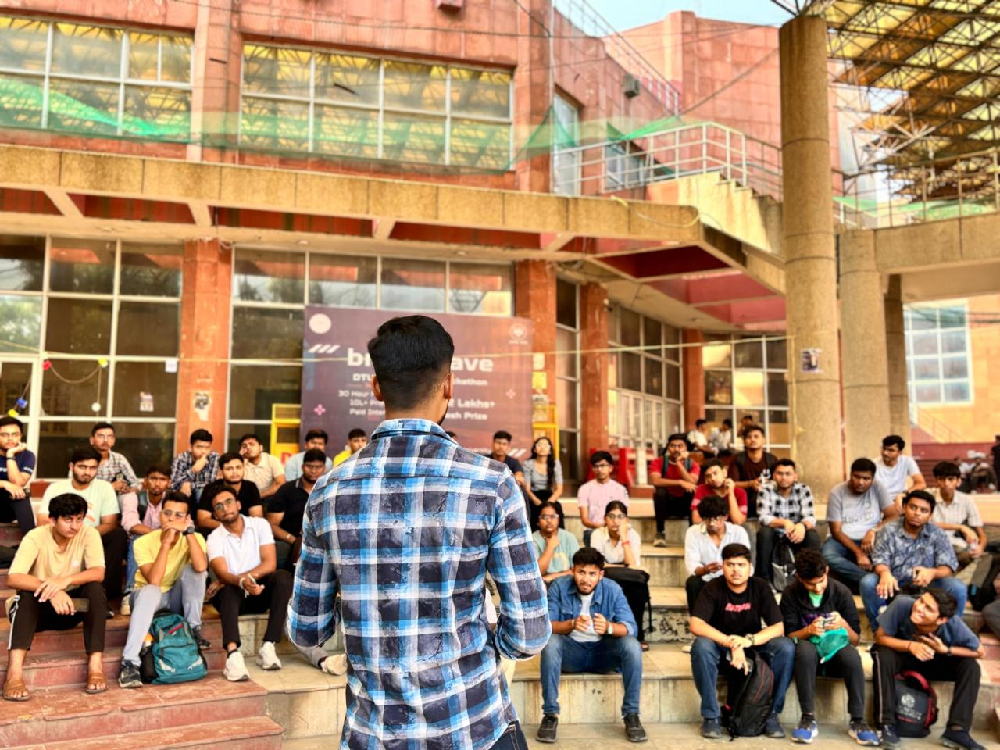

  

<h1 align="center">Hi 👋, I'm Shubham Goswami</h1> 
<h3 align="center">🚀 Full Stack Developer | GDSC Lead | Tech Enthusiast</h3>

 
   

---

### 👨‍💻 About Me  
- 🔭 Currently working on **[Prithvi App](https://shubhamgithub121.github.io/GDSC/index.html)**  
- 🌱 Learning **Node.js, TypeScript & PHP**  
- 👯 Open to collaborate on **[Tomato App](https://tomato-app2.vercel.app/)**  
- 💼 All my projects are here: [Portfolio](https://gleaming-entremet-efc57f.netlify.app/)  
- 💬 Ask me about **React.js, Next.js, APIs, CSS, Full Stack Development**  
- 📄 My Resume: [View Here](https://drive.google.com/file/d/1rJhsV_yKuivZAifbHJ_GT-psAHb3XlvS/view?usp=sharing)  
- ⚡ Fun fact: **I am a Karate Black Belt 🥋**  

---

### 🛠️ Tech Stack  

 

---

### 🚀 Featured Projects  
- 🛒 [Amazon Clone](https://github.com/shubhamgithub121/amazon-clone) – React + Firebase + Authentication + Cart  
- 🎮 [Stone Paper Scissors Game](https://github.com/shubhamgithub121/stone-paper-scissors) – Fun JS Game  
- 📰 [Fake News Detection](https://github.com/shubhamgithub121/fake-news-detection) – ML Project  
- 🧑‍🤝‍🧑 [Women Safety & Health Assistant](https://github.com/shubhamgithub121/women-safety-app) – Hackathon Project  
- 💻 [Portfolio Website](https://gleaming-entremet-efc57f.netlify.app/) – Personal Portfolio  

---

### 📊 GitHub Stats  

  

&nbsp;
  

  

---

### 🤝 Connect With Me  

